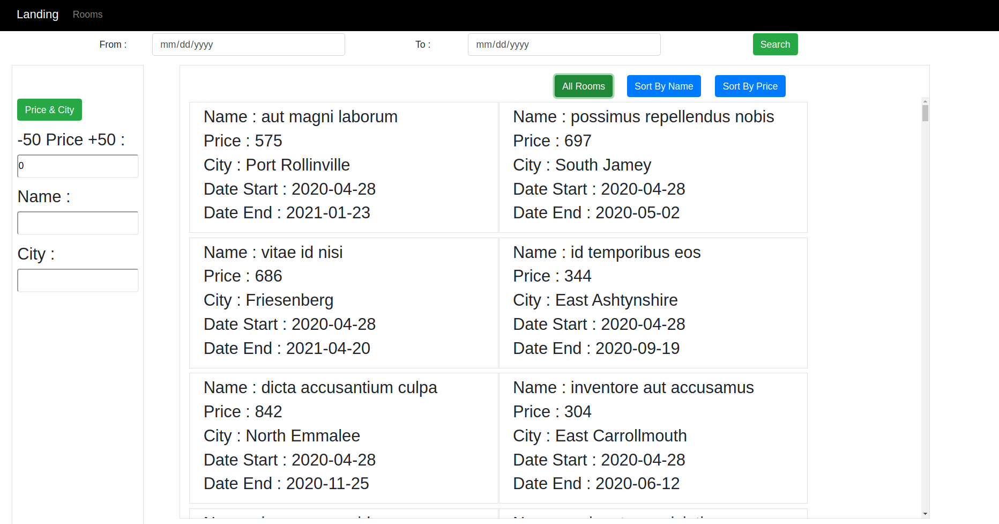
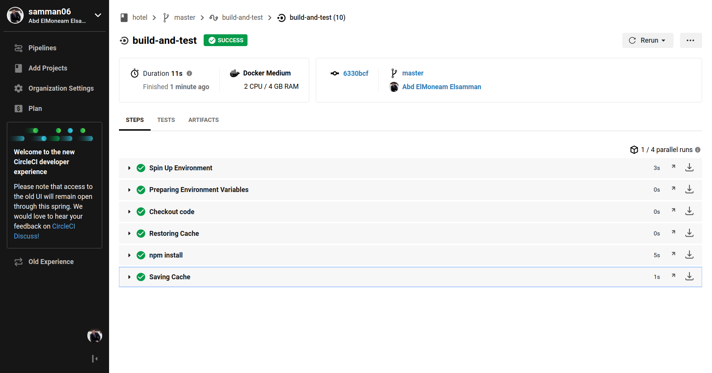
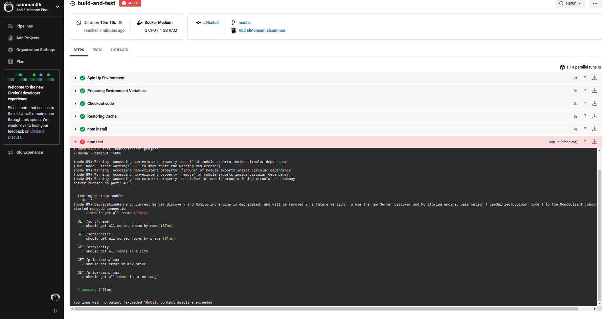

# Hotel Rooms Search
* This is a Hotel Search Site that you can search for room in a different conditions
* This site is developed in node.js(Express), mongoDB and React 

# before running the code
* you can use local mongo database but check on my database name in ./config/keys.js
if you have the same name in your databases please change the name in my keys.js file from "hotel" to another one.

## You Can Do... 
* View all Rooms.
* Search for a room by hotel name.
* Search for a room by city.
* Search for a room by price range.
* Search for a room by date range.
* Search for a room by price range and city.

## Install
* you must have nodejs on your machine and you can install it [nodejs](https://nodejs.org/en/download/).
* you must have mongoDB on your machine and you can install it [mongo](https://docs.mongodb.com/manual/installation/).

## Run the project
* 1 ) Download the project.
* 2 ) start mongoDB service.
* 3 ) Enter the project folder.
* 4 ) Run npm install from the command line to install package.json express dependencies. 
* 5 ) Run node . or node  index.js or npm start
* 6 ) Enter the ./client folder.
* 7 )  Run npm install from the command line to install package.json react dependencies. 
* 8 ) Run npm start
* 9 ) Enjoy.

## Testing
* 1 ) You should have mocha on your machine.
* 2 ) Enter the project folder.
* 3 ) Run npm test.

### photo of The Site

###### Home Page

###### all Rooms

###### Date errors 

###### circle_ci Success 

###### circle_ci failed Because Of Time

